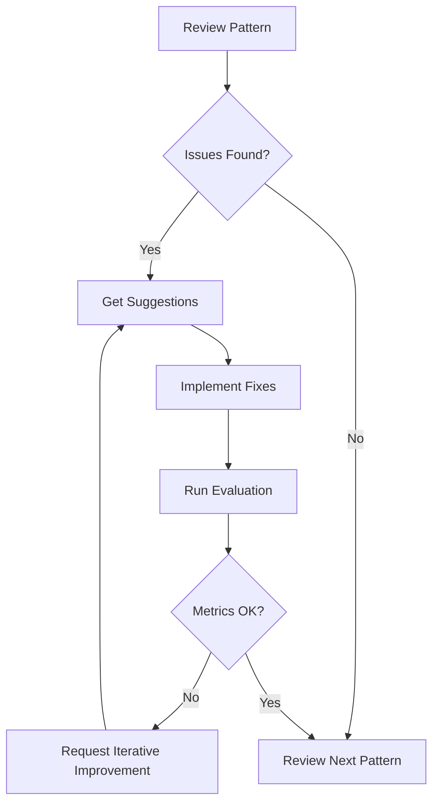

# Pattern Reviewer Agent - Quick Start

## Two Ways to Use This Agent

### 1. **Within Claude Code Session** (Recommended for Interactive Work)

#### Single Pattern Review
```
Use the pattern-reviewer agent to review ml-001-scaler-leakage
```

#### **Parallel Processing** - Multiple Patterns at Once
To review multiple patterns simultaneously, ask me to spawn multiple agents:
```
Spawn 3 pattern-reviewer agents in parallel to review:
- ml-001-scaler-leakage
- ml-002-data-leakage
- ml-003-test-train-split
```

This will create 3 independent agent instances working concurrently, completing in the time it takes to review one pattern.

**Important:** Each agent has its own independent context window - they work in complete isolation without sharing state or memory. This enables true parallelism and efficient resource usage.

**Note:** The agent is configured with `defaultMode: "dontAsk"` so it won't repeatedly ask for file operation permissions.

### 2. **From CLI** (for Automation/Scripts)
```bash
claude --agent pattern-reviewer "Review ml-001-scaler-leakage"
```

---

## 🚀 Get Started in 30 Seconds

### Review a Pattern
```bash
# Using Claude Code CLI
claude --agent pattern-reviewer "Review ml-001-scaler-leakage"
```

### Review a Category
```bash
claude --agent pattern-reviewer "Review all ai-training patterns"
```

### Batch Review
```bash
# Within Claude Code Session - True parallel processing (multiple agents)
"Spawn pattern-reviewer agents in parallel for ml-001, ml-002, ml-003"

# From CLI - Sequential review within single agent
claude --agent pattern-reviewer "Review ml-001, ml-002, ml-003"

# Review by severity (single agent, sequential)
claude --agent pattern-reviewer "Review all critical severity patterns"
```

### Create Test Cases
```bash
claude --agent pattern-reviewer "Create 3 new negative test cases for ml-001"
```

## 📋 Common Tasks

### 1. Find Patterns That Need Work
```
Which patterns have incomplete test coverage or unclear detection questions?
```

### 2. Review a Specific Pattern
```
Review ml-001-scaler-leakage comprehensively and suggest improvements
```

### 3. Improve Detection Question
```
The precision for ml-003 is below target. Suggest improvements to the detection question.
```

### 4. Create Missing Test Cases
```
Create negative test cases for ml-001 that demonstrate correct use of Pipeline
```

### 5. Review by Severity
```
Review all critical severity patterns and identify any with issues
```

## 🎯 What to Expect

### Pattern Review Output

```markdown
## Pattern: ml-001 - scaler-leakage

### Summary
- Category: ai-training
- Severity: critical
- Status: ⚠️ Needs Improvement

### Issues Found
1. Truncated description field
2. Missing test file references
3. Only 1 positive test case

### Recommended Actions
1. Fix TOML metadata
2. Add 3 more positive test cases
3. Create 2-3 negative test cases

### New Test Case Suggestions
[Complete Python code examples]
```

## 🔧 Typical Workflow



### Step-by-Step

1. **Review**: `"Review ml-001-scaler-leakage"`
2. **Get specific suggestions**: Agent provides detailed feedback
3. **Implement fixes**: Update TOML or create test files
4. **Validate**: `python evals/run_eval.py --pattern ml-001`
5. **Iterate if needed**: `"Precision is 0.87, suggest improvements"`

## ⚡ Parallel Processing Architecture

### How Multiple Agents Work

When you spawn multiple pattern-reviewer agents in parallel:

```
Request: "Spawn 5 agents to review ml-001, ml-002, ml-003, ml-004, ml-005"

┌─────────────┐  ┌─────────────┐  ┌─────────────┐  ┌─────────────┐  ┌─────────────┐
│  Agent 1    │  │  Agent 2    │  │  Agent 3    │  │  Agent 4    │  │  Agent 5    │
│             │  │             │  │             │  │             │  │             │
│  Context    │  │  Context    │  │  Context    │  │  Context    │  │  Context    │
│  Window A   │  │  Window B   │  │  Window C   │  │  Window D   │  │  Window E   │
│             │  │             │  │             │  │             │  │             │
│  ml-001     │  │  ml-002     │  │  ml-003     │  │  ml-004     │  │  ml-005     │
└─────────────┘  └─────────────┘  └─────────────┘  └─────────────┘  └─────────────┘
      ↓                ↓                ↓                ↓                ↓
    Result 1         Result 2         Result 3         Result 4         Result 5
```

**Key Points:**
- Each agent has its own isolated context window
- No shared memory or state between agents
- True concurrent execution (not sequential)
- Each agent reads files independently
- Results are consolidated when all complete

### Benefits

✅ **Speed**: 5 patterns in the time of 1
✅ **Efficiency**: Each agent loads only what it needs
✅ **Isolation**: Failures don't cascade
✅ **Scalability**: Spawn as many agents as needed

### When to Use Parallel Processing

**Good for:**
- Reviewing multiple independent patterns
- Creating test cases for different patterns
- Batch validation across categories
- Initial pattern audits

**Not needed for:**
- Single pattern work
- Iterative refinement of one pattern
- Sequential workflows with dependencies

## 💡 Pro Tips

### Tip 1: Be Specific
❌ "Review some patterns"
✅ "Review ml-001-scaler-leakage focusing on test case coverage"

### Tip 2: Provide Context
❌ "Create test cases"
✅ "Create negative test cases for ml-001 that test Pipeline usage and manual split-then-fit approaches"

### Tip 3: Iterate Based on Metrics
After running evaluation:
```
The precision for ml-001 is 0.87 (target 0.90). Analyze potential false positive causes and suggest improvements.
```

### Tip 4: Batch Reviews with Parallel Processing
```
# Speed up reviews by spawning multiple agents
Spawn 5 pattern-reviewer agents in parallel to review all patterns in ai-training category

# Or sequential within single agent (slower but simpler)
Review all patterns in ai-training category and create a priority list for improvements
```

### Tip 5: Focus on Impact
```
Which critical severity patterns have issues? Prioritize by potential impact.
```

## 📊 Quality Targets

| Metric | Overall | Critical Severity |
|--------|---------|-------------------|
| Precision | ≥ 0.90 | ≥ 0.95 |
| Recall | ≥ 0.80 | ≥ 0.80 |
| F1 Score | ≥ 0.85 | ≥ 0.87 |

## 🎓 Example Sessions

### Session 1: Quick Pattern Check
```
You: Review ml-001-scaler-leakage

Agent: [Analyzes pattern, finds 3 issues, suggests fixes]

You: Create the negative test cases you suggested

Agent: [Creates 2 new Python files with complete code]

You: Thanks!
```

### Session 2: Category Improvement
```
You: Review all ai-training patterns and identify top 3 priorities

Agent: [Reviews 15 patterns, ranks by priority]

You: Let's start with #1 on your list. What exactly needs to be done?

Agent: [Provides detailed action plan for top priority pattern]

You: Create those test cases

Agent: [Creates new test files]
```

### Session 3: Metric-Driven Improvement
```
You: I ran eval for ml-001. Precision is 0.87, below target. What's wrong?

Agent: [Analyzes likely causes of false positives]

You: Implement your suggested refinement to the detection question

Agent: [Updates pattern.toml with improved question]

You: Create the negative cases you mentioned for legitimate full-dataset scaling

Agent: [Creates new negative test files]
```

### Session 4: Parallel Pattern Review (Fast!)
```
You: Spawn pattern-reviewer agents in parallel to review ml-001, ml-002, ml-003, ml-004, ml-005

Claude: [Spawns 5 independent agents simultaneously]
         [All 5 agents work concurrently]
         [Returns consolidated results from all agents]

You: Great! Now spawn agents to create test cases for the patterns that need them

Claude: [Spawns multiple agents in parallel to create test files]
```

## 🔍 Finding Specific Issues

### Unclear Detection Questions
```
Find patterns with detection questions that ask multiple things or are too vague
```

### Missing Test Coverage
```
Which patterns have fewer than 3 positive test cases or no negative cases?
```

### Severity Mismatches
```
Review all patterns and identify any where the severity seems mismatched with the actual impact
```

### Incomplete Metadata
```
Find patterns with missing tags, references, or incomplete TOML fields
```

## 📝 Integration with Development

### Before Committing
```bash
# 1. Review your changes
claude --agent pattern-reviewer "Review ml-001-scaler-leakage"

# 2. Run evaluation
python evals/run_eval.py --pattern ml-001-scaler-leakage

# 3. Check metrics meet targets
# If not, iterate with agent
```

### Creating New Patterns
```bash
# 1. Create pattern scaffold
python -m scicode_lint.tools.new_pattern --id ml-999 --name my-pattern --category ai-training --severity critical

# 2. Get agent help with test cases
claude --agent pattern-reviewer "I just created ml-999-my-pattern. Suggest comprehensive test cases for [describe the pattern]"

# 3. Implement suggested test cases

# 4. Review with agent
claude --agent pattern-reviewer "Review ml-999-my-pattern"
```

## 🚨 Troubleshooting

### Agent not finding pattern
- Check pattern ID format: `ml-001-scaler-leakage` (not just `ml-001`)
- Verify pattern exists: `ls patterns/*/ml-001*`

### Suggestions not specific enough
- Provide more context in your request
- Mention specific issues you're seeing
- Include evaluation metrics if available

### Test cases don't match your needs
- Be more specific about scenarios to test
- Provide examples of edge cases
- Mention false positive/negative concerns

## 📚 Learn More

- [README.md](README.md) - Full documentation
- [examples.md](examples.md) - Detailed examples
- [../../../patterns/README.md](../../../patterns/README.md) - Pattern structure
- [../../../CONTRIBUTING.md](../../../CONTRIBUTING.md) - Contributing guide

## 🎯 Quick Reference

| Task | Command Template |
|------|------------------|
| Review pattern | `Review {pattern-id}` |
| Review category | `Review all {category} patterns` |
| **Parallel review** | `Spawn pattern-reviewer agents in parallel to review {pattern-id-1}, {pattern-id-2}, {pattern-id-3}` |
| Find issues | `Which patterns have {specific issue}?` |
| Create tests | `Create {n} {type} test cases for {pattern-id}` |
| Improve metric | `{metric} for {pattern-id} is {value}. Suggest improvements.` |
| Prioritize work | `Which {category/severity} patterns need work? Prioritize.` |

Replace `{...}` with your specific values.

**Pro Tip:** Use parallel agent spawning for speed when reviewing/working on multiple independent patterns!
