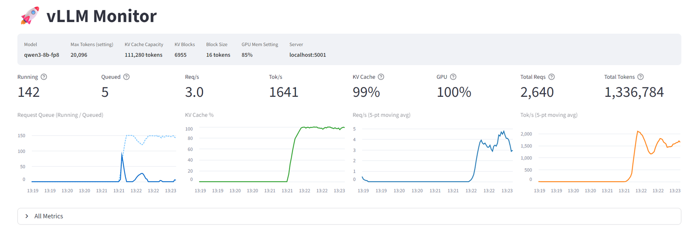

# Benchmarks

Performance benchmarks for scicode-lint. Run these to gather metrics about your system.

## Available Benchmarks

### Speed Benchmark

```bash
python benchmarks/speed_benchmark.py
```

Measures vLLM server performance during eval:

| Metric | Description |
|--------|-------------|
| `throughput_req_s` | Requests per second |
| `total_tokens_per_second` | Input + output tokens/sec |
| `generation_tokens_per_second` | Output tokens/sec |
| `avg_ttft_seconds` | Average time to first token |
| `ttft_p50_seconds` | TTFT 50th percentile |
| `ttft_p90_seconds` | TTFT 90th percentile |
| `peak_running` | Max concurrent requests on GPU |
| `peak_waiting` | Max queued requests |
| `peak_kv_cache_pct` | Peak KV cache utilization |
| `prefix_cache_hit_rate` | Prefix cache efficiency |
| `preemptions` | Requests swapped out due to memory pressure |

Output: `reports/speed/BENCHMARK_SUMMARY.md`

### Max Tokens Experiment

```bash
python benchmarks/max_tokens_experiment.py
```

Tests accuracy at different `max_completion_tokens` values (16384, 8192, 6144, 4096, 2048, 1024, 512).

| Metric | Description |
|--------|-------------|
| `overall_accuracy` | Correct detections / total |
| `positive_accuracy` | True positive rate |
| `negative_accuracy` | True negative rate |
| `execution_time_seconds` | Total eval time |

Output: `reports/max_tokens/BENCHMARK_SUMMARY.md`

---

## Latest Results

### Speed Benchmark (2026-03-09)

**Environment:** RTX 4000 Ada (20GB), WSL2, Qwen3-8B-FP8

| Metric | 100 concurrent | 150 concurrent | 200 concurrent |
|--------|----------------|----------------|----------------|
| Total time | 323.5s | **313.3s** | 317.4s |
| Throughput | 2.48 req/s | **2.56 req/s** | 2.53 req/s |
| Total tok/s | 4,206 | **4,343** | 4,262 |
| Avg TTFT | **0.6s** | 3.0s | 13.6s |
| TTFT p90 | **20s** | 40s | 40s |
| Peak KV cache | **81.5%** | 100% | 100% |
| Preemptions | **0** | 461 | 527 |
| Accuracy | 92.9% | **93.1%** | 92.1% |

**Tradeoffs:**
- **100**: Most stable (zero preemptions), ~10s slower
- **150**: Best throughput, moderate preemptions ← **default**
- **200**: Worst latency, most preemptions, no benefit

**vLLM Dashboard:**



### Max Tokens Experiment (2026-03-09)

| Tokens | Accuracy | Time (s) |
|--------|----------|----------|
| 16384 | 93.0% | 308 |
| 8192 | 92.5% | 320 |
| 4096 | 93.3% | 381 |
| 2048 | 91.3% | 321 |
| 1024 | 85.4% | 287 |
| 512 | 54.6% | 835 |

---

## Configuration Reference

Relevant settings in `config.toml`:

```toml
[llm]
max_input_tokens = 16000
max_completion_tokens = 4096

[performance]
max_concurrent_evals = 150   # Client semaphore (how many requests we send)
vllm_max_num_seqs = 256      # vLLM server capacity (passed to --max-num-seqs)
```

vLLM server settings (read from config.toml by `start_vllm.sh`):
- `--max-model-len`: 20096 (max_input_tokens + max_completion_tokens)
- `--max-num-seqs`: 256 (vllm_max_num_seqs)
- `--kv-cache-dtype`: fp8
- `--gpu-memory-utilization`: 0.85
