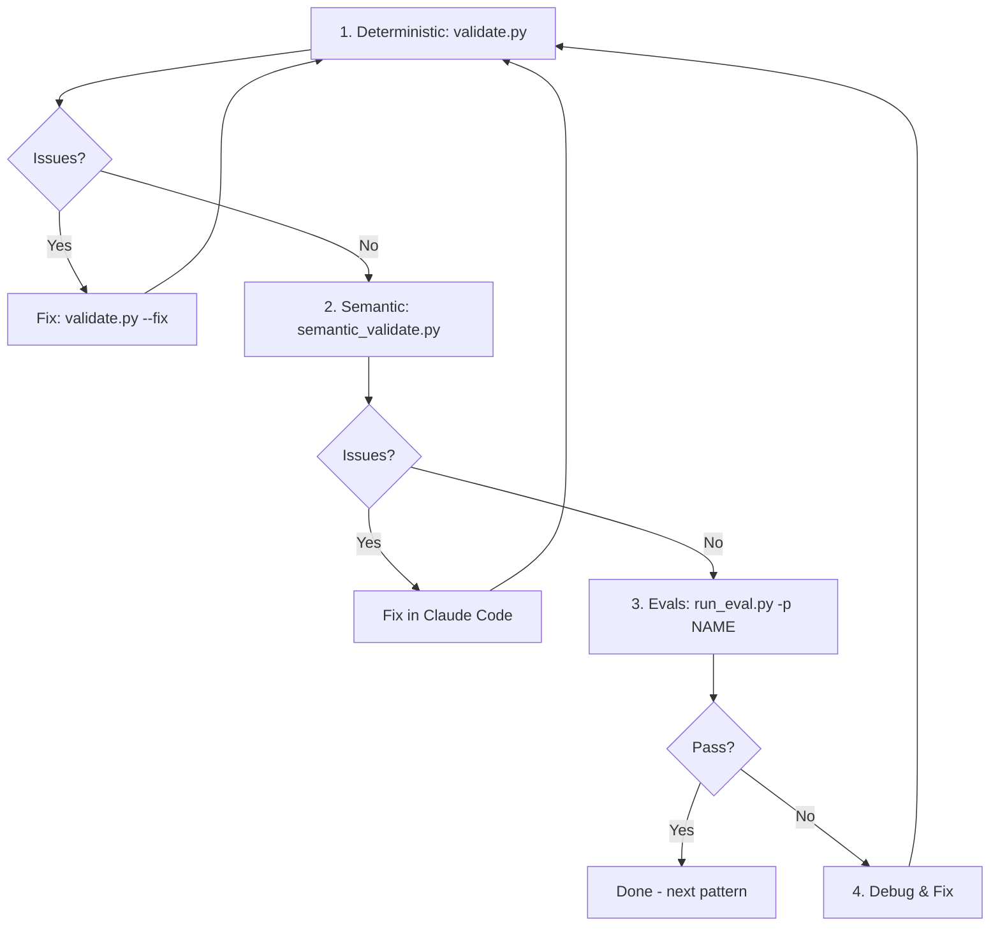
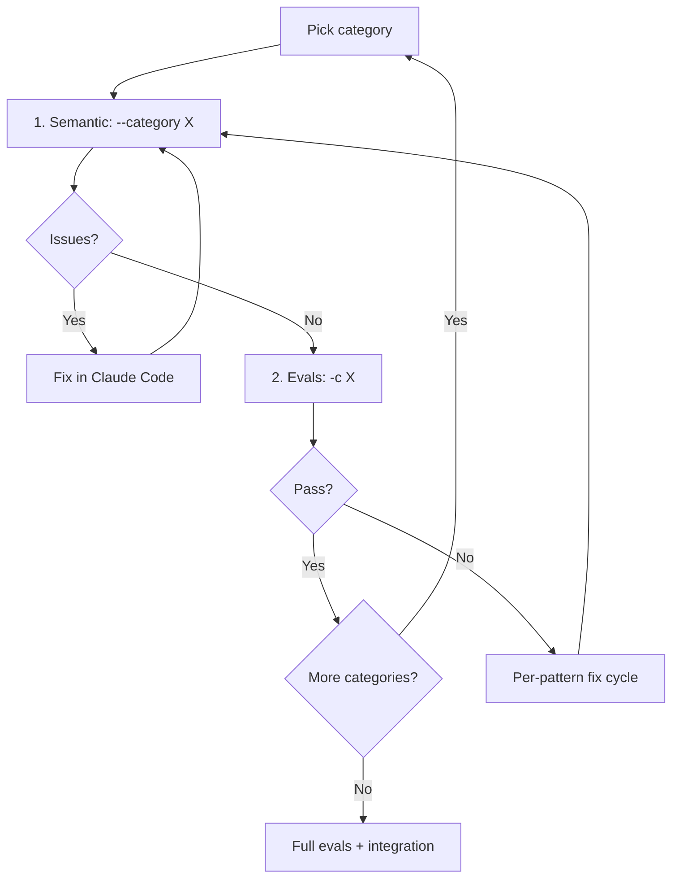

# Continuous Improvement Loop

**Key principle:** Don't fine-tune to specific tests. Extract generalizable principles and apply to ALL patterns.

**Requires:** vLLM server running (runs actual detection against test files)

## Quick Reference

```bash
# 0. Refresh reference docs and clean orphaned cache
python pattern_verification/deterministic/validate.py --fetch-refs --clean-cache

# Structural validation (no LLM needed)
python pattern_verification/deterministic/validate.py           # all patterns
python pattern_verification/deterministic/validate.py --fix     # auto-fix

# Semantic validation (uses LLM)
python pattern_verification/semantic/semantic_validate.py <id>  # single pattern
python pattern_verification/semantic/semantic_validate.py --all # all patterns

# Evals (uses LLM)
python evals/run_eval.py                                        # all patterns
python evals/run_eval.py -p <pattern-name>                      # single pattern
python evals/run_eval.py -p <name1> -p <name2>                  # multiple patterns
```

## Per-Pattern Fix Cycle

When a pattern has issues, iterate on **that specific pattern** until it passes:



### Commands (for specific pattern)

```bash
# 0. Refresh reference docs and clean orphaned cache
python pattern_verification/deterministic/validate.py --fetch-refs --clean-cache

# 1. Deterministic validation
python pattern_verification/deterministic/validate.py
python pattern_verification/deterministic/validate.py --fix  # auto-fix if issues

# 2. Semantic validation (uses pattern-reviewer agent - read-only)
python pattern_verification/semantic/semantic_validate.py pt-007
# If issues found → fix directly in Claude Code session before proceeding to evals

# 3. Evals (requires vLLM) - note: uses full pattern name
python evals/run_eval.py -p pt-007-inference-without-eval

# 4. If evals fail: debug and fix
python -m scicode_lint check <test-file> --pattern pt-007 --verbose
# Fix issues directly in Claude Code session

# After ANY pattern changes, run deterministic validation immediately:
python pattern_verification/deterministic/validate.py pt-007

# Repeat from step 1 until all pass
```

**Note:** `semantic_validate.py` uses the `pattern-reviewer` agent (read-only) to identify issues. Fix issues directly in your Claude Code session.

### Multiple Patterns

When fixing a group of patterns, use the same cycle:

```bash
# Validate all (or use --fix for auto-fixes)
python pattern_verification/deterministic/validate.py

# Semantic validation for specific patterns
python pattern_verification/semantic/semantic_validate.py pt-007 pt-013 ml-005

# Run evals on the group
python evals/run_eval.py -p pt-007-inference-without-eval \
                         -p pt-013-missing-inference-mode \
                         -p ml-005-cv-temporal-shuffle

# Fix any failures, repeat until all pass
```

## Category-by-Category Workflow (Recommended)

Work through categories sequentially - complete one fully before moving to next:



**Why this approach:**
- Smaller batches (12-15 patterns) = easier to track
- Issues in same category often share patterns
- Generalizable fixes apply to whole category at once
- Clear completion milestones

```bash
# Categories in order
# ai-inference, ai-training, scientific-numerical, scientific-performance, scientific-reproducibility

# Refresh reference docs and clean orphaned cache
python pattern_verification/deterministic/validate.py --fetch-refs --clean-cache

# Example: complete ai-inference category
python pattern_verification/deterministic/validate.py
python pattern_verification/semantic/semantic_validate.py --category ai-inference
# Fix issues in Claude Code session...

python evals/run_eval.py -c ai-inference
# Fix any failures, repeat until category passes

# Move to next category
python pattern_verification/semantic/semantic_validate.py --category ai-training
# ... continue
```

## Final Verification

After all categories pass individually, run full validation to catch cross-category issues:

```bash
# Full validation (catches cross-category issues)
python pattern_verification/deterministic/validate.py
python pattern_verification/semantic/semantic_validate.py --all

# Full evals - get overall accuracy
python evals/run_eval.py
# Report: evals/reports/judge/llm_judge_report.md

# Update README.md with accuracy stats from report

# Integration tests (holdout)
python evals/integration/run_integration_eval.py
python evals/integration/dynamic_eval.py
```

## Generalizable Fixes

When fixing a pattern, look for principles that apply broadly:

1. **Found a generalizable principle?**
   - Add to `patterns/README.md`
   - Apply to ALL relevant patterns, not just the failing one

2. **Example generalizations:**
   - "Snippets should point to bug location, not class definition"
   - "NO criteria must cover all valid negative cases explicitly"
   - "Detection questions need clear YES/NO decision boundaries"

## Integration Tests (holdout set)

Tests generalization - did we overfit to pattern-specific tests?

```bash
python evals/integration/run_integration_eval.py     # static integration
python evals/integration/dynamic_eval.py             # dynamic integration
```

## Evaluation Types

| Type | Purpose |
|------|---------|
| Pattern-specific | Iterate on individual patterns |
| Static integration | Holdout - test all patterns on realistic code |
| Dynamic integration | Holdout - test on fresh LLM-generated code |

## Critical Constraint

- **No hints in test files** - pure code only, no comments about bugs (data leakage in evaluation)
