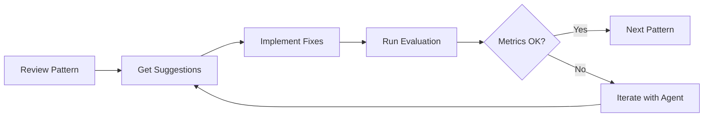
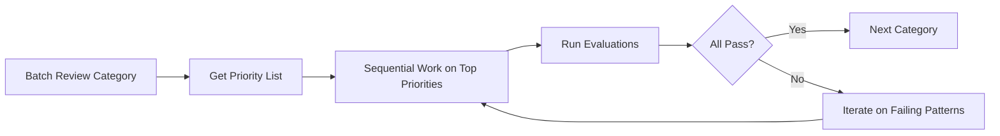

# Development Tools

Development tools and agents for working on the scicode-lint codebase.

---

## Pattern Reviewer Agent

**Location:** `.claude/agents/pattern-reviewer/`

**⚠️ Requirements:** This agent requires [Claude Code CLI](https://github.com/anthropics/claude-code). It is specifically designed as a Claude Code agent and will not work with standard Claude interfaces or other AI tools.

**⚡ Parallel Processing:** This agent can review multiple patterns concurrently, making it efficient for batch operations like reviewing entire categories or finding patterns with specific issues across the codebase.

A specialized Claude agent for reviewing, improving, and creating test cases for pattern definitions.

### Purpose

Maintain high-quality pattern definitions by:
- Reviewing pattern TOML files for completeness and clarity
- Analyzing test cases (positive, negative, context-dependent)
- Suggesting improvements to detection questions and warning messages
- Creating new test cases to improve coverage
- Identifying patterns needing work
- Iteratively improving patterns based on evaluation metrics
- **Processing multiple patterns in parallel for efficient batch operations**

### Quick Start

#### Using Helper Script (Recommended)

```bash
# Review a specific pattern
./scripts/review_patterns.sh review ml-001-scaler-leakage

# Review all patterns in a category
./scripts/review_patterns.sh review-category ai-training

# Find patterns with issues
./scripts/review_patterns.sh find-issues

# Create new test cases
./scripts/review_patterns.sh create-tests ml-001-scaler-leakage
```

#### Using Claude Code CLI Directly

```bash
# Review a pattern
claude --agent pattern-reviewer "Review ml-001-scaler-leakage comprehensively"

# Find issues across all patterns
claude --agent pattern-reviewer "Which patterns have incomplete test coverage?"

# Create test cases
claude --agent pattern-reviewer "Create negative test cases for ml-001 showing Pipeline usage"

# Improve based on metrics
claude --agent pattern-reviewer "Precision for ml-001 is 0.87 (below 0.90). Suggest improvements."
```

### Batch Operations

**The agent supports parallel review of multiple patterns:**

```bash
# Review specific patterns in parallel
claude --agent pattern-reviewer "Review ml-001, ml-002, ml-003 in parallel"

# Review by category
claude --agent pattern-reviewer "Review all ai-training patterns"

# Review by severity
claude --agent pattern-reviewer "Review all critical severity patterns"

# Find patterns matching criteria
claude --agent pattern-reviewer "Find patterns with fewer than 3 test cases and review them"
```

**Benefits of batch processing:**
- Identify common issues across patterns
- Prioritize work by impact
- Get category or severity-level insights
- More efficient than sequential reviews

**See:** [Pattern Reviewer - Batch Operations](../.claude/agents/pattern-reviewer/BATCH_OPERATIONS.md)

### Typical Workflow



**Batch workflow:**


**Step by step:**

1. **Review pattern:**
   ```bash
   claude --agent pattern-reviewer "Review ml-001-scaler-leakage"
   ```

2. **Implement suggested fixes:**
   - Update `pattern.toml` based on suggestions
   - Create new test case files as recommended
   - Fix any identified issues

3. **Run evaluation:**
   ```bash
   python evals/run_eval.py --pattern ml-001-scaler-leakage
   ```

4. **Check metrics:**
   - Precision ≥ 0.90 (overall), ≥ 0.95 (critical severity)
   - Recall ≥ 0.80
   - F1 ≥ 0.85

5. **Iterate if needed:**
   ```bash
   claude --agent pattern-reviewer "Precision is 0.87, below target. Suggest improvements."
   ```

### Parallel Processing Capability

**Key feature:** The agent can analyze multiple patterns concurrently using Claude Code's parallel execution capabilities.

**Batch operations include:**
- Review specific pattern lists: `"Review ml-001, ml-002, ml-003 in parallel"`
- Review by category: `"Review all ai-training patterns"`
- Review by severity: `"Review all critical severity patterns"`
- Find by criteria: `"Find patterns with fewer than 3 test cases"`

**Benefits:**
- **Efficiency:** Review 8-10 patterns in 4-6 minutes vs 30-40 minutes sequentially
- **Insights:** Identify common issues across patterns
- **Prioritization:** Get ranked action list across multiple patterns
- **Consistency:** Find category-wide or severity-level patterns

See [Pattern Reviewer - Batch Operations](../.claude/agents/pattern-reviewer/BATCH_OPERATIONS.md) for comprehensive guide.

### What the Agent Can Do

#### 1. Review Pattern Definitions (Single or Batch)

Analyzes `pattern.toml` files for:
- ✅ Complete metadata (id, name, category, severity, version)
- ✅ Clear and focused detection question
- ✅ Actionable warning message
- ✅ Appropriate severity level
- ✅ Comprehensive explanation
- ✅ Relevant tags and related patterns
- ✅ Quality targets (precision, recall)

#### 2. Review Test Cases

Examines test files in:
- **positive/** - Code with bugs (must detect)
  - Realistic scenarios
  - Clear docstrings explaining the bug
  - Good coverage of variations

- **negative/** - Correct code (must NOT detect)
  - Comprehensive edge cases
  - Docstrings explaining the fix
  - Similar to positive cases but corrected

- **context_dependent/** - Ambiguous cases
  - Nuanced scenarios
  - Clear context notes

#### 3. Suggest Improvements

Provides:
- Better detection questions (more focused, less ambiguous)
- Clearer warning messages (more actionable)
- New test case ideas (missing scenarios)
- Severity adjustments (if mismatched)
- Related pattern suggestions
- Tag improvements

#### 4. Create New Test Cases

Creates:
- Realistic code examples with comprehensive docstrings
- Multiple variations of the same bug
- Edge cases and boundary conditions
- False positive prevention cases

### Quality Standards Enforced

| Metric | Overall | Critical Severity |
|--------|---------|-------------------|
| Precision | ≥ 0.90 | ≥ 0.95 |
| Recall | ≥ 0.80 | ≥ 0.80 |
| F1 Score | ≥ 0.85 | ≥ 0.87 |

### Common Use Cases

#### Find Patterns Needing Work

```bash
claude --agent pattern-reviewer "Which patterns have incomplete test coverage or unclear detection questions? Prioritize by severity."
```

**Output:** List of patterns with issues, severity, and recommended actions.

#### Review All Patterns in a Category

```bash
./scripts/review_patterns.sh review-category ai-training
```

**Output:** Category overview with pattern-by-pattern analysis and priority list.

#### Improve Pattern Based on Metrics

```bash
# After running evaluation and finding precision below target
claude --agent pattern-reviewer "Precision for ml-003 is 0.85. What's causing false positives?"
```

**Output:** Analysis of likely causes with specific suggestions for fixes.

#### Create Missing Test Cases

```bash
claude --agent pattern-reviewer "Create 3 negative test cases for ml-001 demonstrating correct Pipeline usage and manual split-then-fit"
```

**Output:** Complete Python files with code and docstrings ready to use.

### Documentation

- **[QUICK_START.md](../.claude/agents/pattern-reviewer/QUICK_START.md)** - 30-second guide
- **[README.md](../.claude/agents/pattern-reviewer/README.md)** - Complete documentation
- **[examples.md](../.claude/agents/pattern-reviewer/examples.md)** - 5 detailed examples
- **[system_prompt.md](../.claude/agents/pattern-reviewer/system_prompt.md)** - Agent instructions

### Integration with Development Workflow

#### Before Committing Pattern Changes

```bash
# 1. Review your changes
claude --agent pattern-reviewer "Review ml-001-scaler-leakage"

# 2. Run evaluation
python evals/run_eval.py --pattern ml-001-scaler-leakage

# 3. Verify metrics meet targets
# If not, iterate with agent feedback
```

#### Creating New Patterns

```bash
# 1. Create pattern scaffold
python -m scicode_lint.tools.new_pattern \
    --id ml-999 \
    --name my-pattern \
    --category ai-training \
    --severity critical

# 2. Get agent suggestions for test cases
claude --agent pattern-reviewer "Suggest comprehensive test cases for ml-999: [describe pattern]"

# 3. Implement suggested test cases

# 4. Review with agent
claude --agent pattern-reviewer "Review ml-999-my-pattern"

# 5. Run evaluation
python evals/run_eval.py --pattern ml-999-my-pattern
```

### Example Output

```markdown
## Pattern: ml-001 - scaler-leakage

### Summary
- Category: ai-training
- Severity: critical
- Status: ⚠️ Needs Improvement

### Strengths
- Clear detection question focused on scaler fitting order
- Critical severity appropriate for data leakage
- Good explanation of research impact

### Issues Found
1. **Description field truncated** - Fix pattern.toml line 15
2. **Missing test file references** - Update tests section
3. **Only 1 positive test case** - Need 3-4 variations

### Recommended Actions
1. Fix truncated description in pattern.toml
2. Add 3 more positive test cases
3. Create 2-3 negative test cases showing Pipeline usage

### New Test Case Suggestions
[Complete Python code examples with docstrings]
```

---

## Helper Scripts

### review_patterns.sh

**Location:** `scripts/review_patterns.sh`

Convenience wrapper for the pattern-reviewer agent.

**Commands:**
```bash
# Review a pattern
./scripts/review_patterns.sh review <pattern-id>

# Review a category
./scripts/review_patterns.sh review-category <category>

# Find issues
./scripts/review_patterns.sh find-issues

# Create test cases
./scripts/review_patterns.sh create-tests <pattern-id>

# Help
./scripts/review_patterns.sh help
```

---

## Other Development Tools

### Pattern Scaffolding Tool

**Location:** `src/scicode_lint/tools/new_pattern.py`

Creates new pattern directory structure with template files.

**Usage:**
```bash
python -m scicode_lint.tools.new_pattern \
    --id ml-999 \
    --name my-pattern \
    --category ai-training \
    --severity critical
```

### Pattern Validation Tool

**Location:** `src/scicode_lint/tools/validate_pattern.py`

Validates pattern TOML structure and completeness.

**Usage:**
```bash
python -m scicode_lint.tools.validate_pattern \
    patterns/ai-training/ml-001-scaler-leakage
```

### Registry Rebuild Tool

**Location:** `src/scicode_lint/tools/rebuild_registry.py`

Regenerates the pattern registry from TOML files.

**Usage:**
```bash
python -m scicode_lint.tools.rebuild_registry
```

### Evaluation Framework

**Two-tier evaluation system:**

#### 1. Pattern-Specific Evaluations

**Location:** `evals/`

Tests individual patterns in isolation with both hardcoded ground truth and LLM-as-judge approaches.

```bash
# Hardcoded ground truth (fast, deterministic)
python evals/run_eval.py --pattern ml-001-scaler-leakage

# LLM-as-judge (semantic correctness)
python evals/run_eval_llm_judge.py --pattern ml-001-scaler-leakage

# Run all patterns
python evals/run_eval.py

# Run as pytest
pytest evals/test_all_patterns.py -v
```

#### 2. Integration Evaluations

**Location:** `evals/integration/`

Tests multi-pattern detection on realistic code with multiple bugs. Validates that:
- Multiple patterns can run concurrently without interference
- Linter detects bugs in realistic, complex code
- Overall system performance meets targets

```bash
# Hardcoded ground truth (exact pattern ID matching)
python evals/integration/run_integration_eval.py -v

# LLM-as-judge (semantic bug detection)
python evals/integration/run_integration_eval_llm_judge.py -v

# Specific scenario
python evals/integration/run_integration_eval.py --scenario ml_pipeline_complete -v
```

**See:** [evals/integration/README.md](../evals/integration/README.md) for details

---

## See Also

- [ARCHITECTURE.md](ARCHITECTURE.md) - Design principles
- [IMPLEMENTATION.md](IMPLEMENTATION.md) - Technical details
- [../CONTRIBUTING.md](../CONTRIBUTING.md) - Contribution guidelines
- [../patterns/README.md](../patterns/README.md) - Pattern structure
- [../evals/README.md](../evals/README.md) - Pattern evaluations
- [../evals/integration/README.md](../evals/integration/README.md) - Integration evaluations
